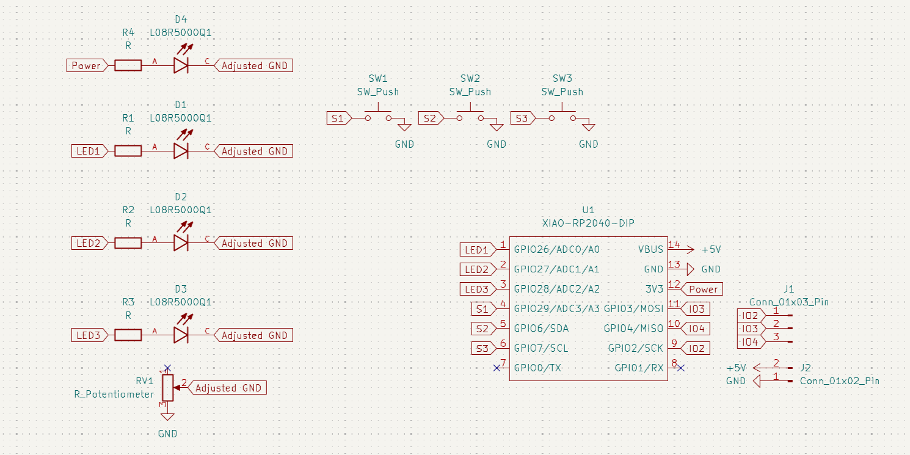
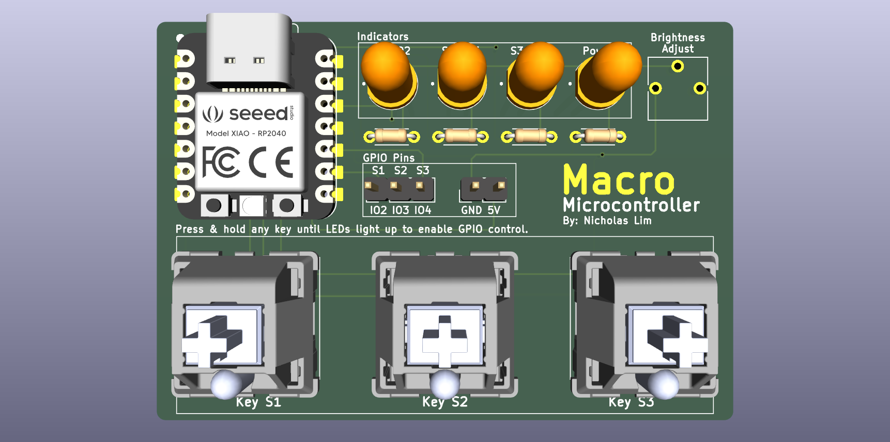
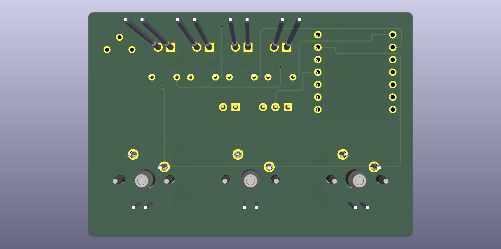

# Macro Microcontroller
A microcontroller and macropad combined in a single PCB, with GPIO pins for external connections.
It can control GPIO pin output using keys or as a normal microcontroller with GPIO pins as input or output.

To enable GPIO control mode for a particular key, hold the any key until the LED lights up for 1 second. Reset the MCU to return to default mode.

To program the microcontroller, add code in the `userProgram()` function.

## Schematic

## PCB

